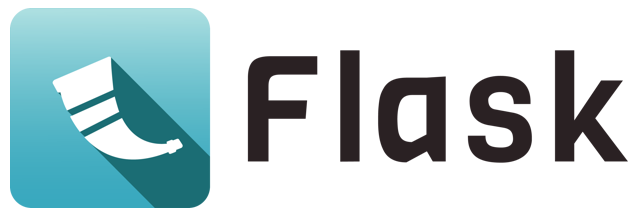

# FakePinterest - Uma réplica do Pinterest

## Table of contents

- [Visão Geral](#visão-geral)
  - [O Projeto](#o-projeto)
  - [Screenshots](#screenshots)
- [Processo de Criação](#processo-de-criação)
- [Autora](#autora)

## Visão Geral

Este projeto é uma réplica do [Pinterest](https://br.pinterest.com/) construída com o [Flask](https://flask.palletsprojects.com/en/2.3.x/), framework do Python.  

### O Projeto

Os usuários podem:

- Criar uma conta/Fazer login
- Postar fotos
- Ver um feed geral com fotos de todos os usuários
- Visualizar o perfil de um outro usuário ao clicando em uma foto no feed

### Screenshots

Esta seção é uma dedicada as capturas de tela feitas diretamente do projeto 

**Tela Inicial:** esta é a tela inicial, assim que o usuário entra no site

  
  
  

**Criar Conta** esta é a tela para criação de conta para qual o usuário é encaminhado quando clica no link para criação de conta

  
  
  

**Perfil do usuário:** tela de perfil do usuário, onde é possível postar novas fotos e visualizar as fotos já postadas anteriormente

  
  
  

**Feed principal:** feed principal onde os usuários conseguem visualizar todas as fotos já postadas por todos os usuários 

  
  
  

**Perfil de outro usuário** visualização do perfil de um outro usuário quando o usuário logado clica em alguma foto do feed principal

  
  
  

## Processo de Criação

O backend deste projeto foi todo construído com [Flask](https://flask.palletsprojects.com/en/2.3.x/), framework do Python para desenvolvimento web e o banco de dados foi inicialmente construído com SQLite e para segurança da autenticação de usuário foi utilizado o `Bcrypt`.

  
  
  

O frontend foi construído do zero sem o uso de nenhum framework

## Autora

Esteja a vontade para me acompanhar nas redes sociais

- LinkedIn - [Alessandra Oliveira](https://www.linkedin.com/in/alessandra-santos-oliveira/)
- Twitter - [@itsale_o](https://www.twitter.com/itsale_o)

